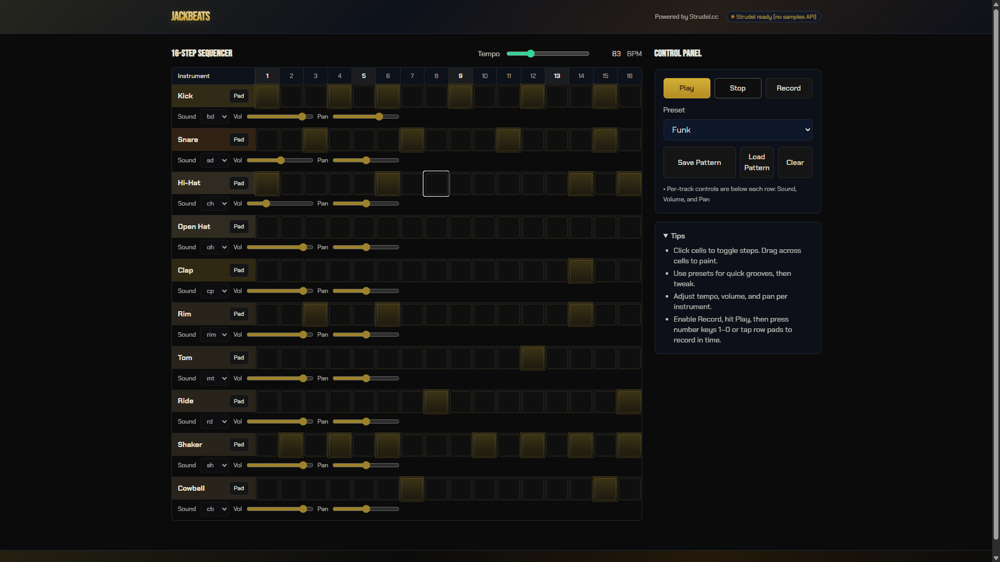

# JACKBEATS 🎯

## Basic Details
### Team Name: JACKBOYS

### Team Members
- Team Lead: Nehan Bahar - SCMS SCHOOL OF ENGINEERING AND TECHNOLOGY
- Member 2: Hadi Konnola - SCMS SCHOOL OF ENGINEERING AND TECHNOLOGY

### Project Description
JACKBEATS is a gloriously useless browser beat machine. It’s a 16‑step sequencer with drum rows, tempo, presets, record mode, and per‑track controls. It runs entirely in your browser.

### The Problem (that doesn't exist)
Idle finger-tapping produces nothing but noise and judgmental looks. Your keyboard wants to be a drum machine.

### The Solution (that nobody asked for)
Click, tap pads, or use number keys to drop hits onto a quantized grid. Loop at your chosen BPM and pretend it’s art. Save and load patterns to keep the chaos.

## Technical Details
### Technologies/Components Used
For Software:
- Languages: HTML, CSS, JavaScript
- Libraries (CDN):
  - @strudel/web (Strudel.cc) for pattern scheduling and audio playback
  - Tailwind CSS (styling)
- Tools: None required to run (optional: a simple static server / VS Code Live Server)

For Hardware:
- Components: Any keyboard, speakers/headphones
- Specs: Works in modern Chromium/Firefox
- Tools required: None (optional USB MIDI keyboard for extra chaos)

### Repository Structure
- index.html — markup, Tailwind CDN, Strudel CDN, app bootstrapping
- script.js — sequencer logic, Strudel integration, save/load, presets
- style.css — custom theme and component styles
- README.md — this file

### How to Run
- Easiest: open index.html in a modern browser.
- Recommended: serve the folder with any static server (avoids local file restrictions and ensures CDN loads).
  - VS Code: use the Live Server extension.
  - Python (optional): `python -m http.server 5500` then open http://localhost:5500/
  - Any static server works.

Live demo (if deployed):
- https://useless-project-temp-mocha.vercel.app/

### Controls & Features
- 16‑Step grid per instrument — click cells to toggle; drag to paint across cells.
- Pads (per row) — left‑click to audition the sound; when Record is on and playing, it writes to the current step.
- Transport — Play / Stop.
- Tempo — slider (40–200 BPM).
- Record — toggles live input recording to the playhead. Number keys 1–0 map to the first 10 instruments.
- Presets — Hip‑Hop, House, Trap, Funk.
- Per‑track controls — Sound (sample token), Volume, Pan.
- Save / Load — stores pattern and per‑track settings in localStorage.
- Clear — clears all steps.

Note: Pads respond to left‑click only; right‑click is not used.

### Project Documentation
For Software:

# Screenshots (Add at least 3)

### Project Demo
# Video
<video controls src="jack.mp4" title="Title"></video>

## Team Contributions
- Nehan Bahar: concept, code, design
- Hadi Konnola: code, output, debug

## Troubleshooting
- No sound? Many browsers require a user gesture to start audio. Click Play or a Pad first.
- “Strudel not found” or no drums? Ensure you’re online so the @strudel/web CDN and sample bank can load.
- Latency or crackles? Close extra tabs, try a different browser, or reduce system load.
- Saved pattern didn’t load? localStorage is origin‑scoped; loading from a different URL/port won’t see prior saves.

---
Made with ❤️ at TinkerHub Useless Projects 

